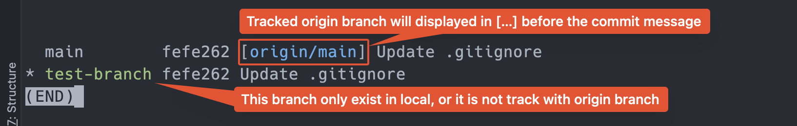
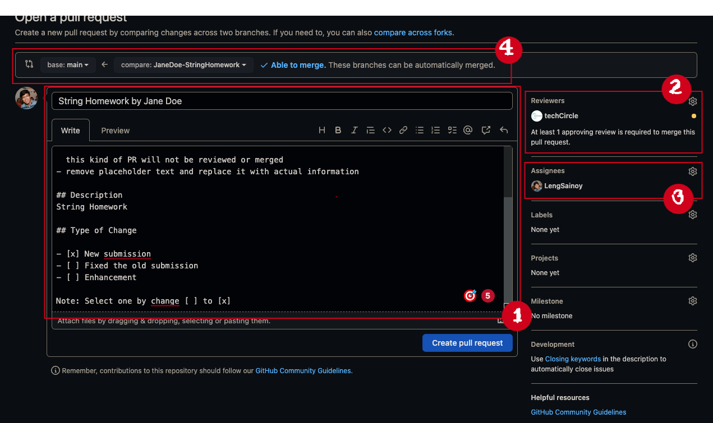
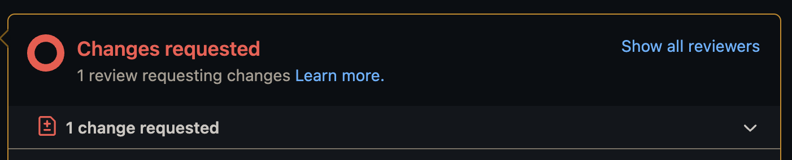

> **Rules:**
>- Do NOT make any commit in `main` / `master` branch.
>- All Git command _must_ to be run in _root directory_ of your project

# 📚 Homework Repository

###### **Version 3.1**

This repository is for homework submission. This is for educational propose. 


----

### Table of Contents

- [Prerequisite](https://github.com/LengSainoy/Homeworks#prerequisite)
- [Configuring Git](https://github.com/LengSainoy/Homeworks#configuring-git) - (optional, but highly recommend)
- [How to setup the project](https://github.com/LengSainoy/Homeworks#how-to-setup-the-project)
- [Create pull request](https://github.com/LengSainoy/Homeworks#create-pull-request)
- [Get the latest code](https://github.com/LengSainoy/Homeworks#get-the-latest-code)
- [To setup local repository](https://github.com/LengSainoy/Homeworks#to-setup-local-repository) - 
- [FAQ](https://github.com/LengSainoy/Homeworks#faq)
- [Tips](https://github.com/LengSainoy/Homeworks#tips)
- [Docs & References](https://github.com/LengSainoy/Homeworks#docs--references)

----

## 👀 Prerequisite

- [JDK] 15 or later
- [Git]
- IDE - Your favorite text editor
  - [IntelliJ IDEA]**
  - [Visual Studio Code]
  - [Eclipse]
  - [Sublime Text]
- Any Shell script Software to run linux command
  - For WindowOS: Powershell, Git Bash
  - For MacOS: Terminal, [iTerm2](https://iterm2.com/)
  - Built-in IDE's Terminal
- Have Github.com credentials setup
  
----

## 🛠️ Configuring Git

Before you start using git for the first time. there are a few _global_ setting that need to be done.

- Set name

```shell
git config --global user.name "<your name>"
```

- Set email

```shell
git config --global user.email "<your github email>"
```

These name and email will show up in `git log`. So we can track ownership of each commit

- Set auto line feed

```shell
# for MacOS
git config --global core.autocrlf input
# for Windows
git config --global core.autocrlf true 
```

You can learn more about autocrlf [here][autocrlf video]

- _Optional:_ Set a default code editor for Git. (refer to [Github docs]) 

  These command will be difference regarding which text editor program you'd like to use. By default it will be _vi_
> **Note:** you will need to install these 3rd party application **before running** these command
  - To change to your plain text editor. for windows user, you will need [Notepad++]
```shell
# windows
git config --global core.editor "'C:/Program Files (x86)/Notepad++/notepad++.exe' -multiInst -notabbar -nosession -noPlugin"
# mac
git config --global core.editor "open -e -w -n"
```
  - To change to [Sublime Text]
```shell
# windows for sublime text 3
git config --global core.editor "'c:/program files/sublime text 3/subl.exe' -w"
# mac
git config --global core.editor "subl -n -w"
```
  - To change to [Visual Studio Code]
```shell
# both mac and windows
git config --global core.editor "code -w"
```

----

## 👨🏻‍🔧 How to setup the project

Please follow steps below to setup this project

### Step1: Clone the repository

###### To clone the repository:

```bash
git clone https://github.com/LengSainoy/Homeworks.git
```

### Step2: Create your branch for that particular homework.

- You should only spin off you new branch from `main` branch only
- **Branch name** should be in following format `FullName-HomeworkName`.
- For example, if you name is **Jane Doe** and doing **String homework**. Your branch name should be
  `JaneDoe-StringHomework`

Before run this command, you will need to be on `main` branch.

###### To check your current branch:

```shell
git branch
```

###### And to create a new branch:

```bash
git branch <branch_name>
```

> #### Optional: If you create branch by mistake
> Before run this command, you will need to switch to different branch.
> ###### To delete local branch:
> ```shell
> # you cannot checkout to to-be-deleted branch while running this command
> git branch -d <branch_name_to_be_deleted>
> ```
> or make any typo to the branch name and want to rename it. Use below command
> ###### To rename your current branch:
> ```shell
> git branch -M <new_branch_name>
> ```

### Step3: Switch to your branch

###### To switch the branch:

```bash
#either
git checkout <branch_name>
#or
git switch <branch_name>
```

> **Tip:** Or combine Step2 & Step3 with `git switch -C <branch_name>` or `git checkout -b <branch_name>`

### Step4: Import the project
**You can also do this step before [Step2](https://github.com/LengSainoy/Homeworks#step2-create-your-branch-for-that-particular-homework)

- Open your IDE, then import the recent cloned project.
- **For IntelliJ user**, if you still don't see `/src` folder you may need to create a project module
  like [so](https://www.jetbrains.com/help/idea/creating-and-managing-modules.html#multimodule-projects)

### Step5: (Optional) Check your current branch

- Open the cloned project, and make sure that you are _checked out to your new branch_ before start
  the work. (you **will not** work on `main`)

###### To check your current branch: (if you don't have `zsh` or `bash`)

```bash
git branch
```

### Step6: Create a new package

- Create new package in your name under `submission` directory under each homework directory
- Your package name should be in following format `firstname_lastnameinitial` all lowercase.

> **For Example:** If you name is `Jane Doe` and you try to do homework in `stringtask`.
> Your package name will be `stringtask/submission/jane_d` or
> `stringtask.submission.jane_d`. (Both are the same location)

---

## 🌐 How to implement the task in local, and push to [Github.com][homework repo]

### Step1: Implement your task in your branch

- You must only do the tasks in your branch (not in `main`)
- To [check the current branch]
- To [switch the branch]
- All task instructions should be under `teacher` package for your reference.
- double check that your code can run locally before doing any commit

### Step2: Commit the changes

First you will need to add all the changes to index or [Staging Area]. if you do not under stand concept of _staging 
area_, I strongly recommend to watch this [video][Staging Area]

###### To add file(s) to [Staging Area]:

```shell
# add everything
git add .
# or add single file
git add <file_name1>
# or add multiple files. separate file names with a space ` `
git add <file_name1> <file_name2>
```

###### Then commit all files in [Staging Area]:

```shell
git commit -m "this message should be meaningful"
```

> _Optional:_ if you make a commit by mistake, run
> ###### to undo the previous commit
> ```shell
> git reset HEAD~
> ```
> or see this article about [undo change]

### Step3: Push you code to remote repository

use either one of the command below to push it to [github.com][homework repo]

- If you *never* have origin <branch_name> branch (on GitHub)

> Optional:
> ###### To check existing origin branch
> ```bash
> git branch -a
> # it will show list of local branches & origin branches
> ```
> ###### To check that your local branch is *track* with origin branch
> ```bash
> git branch -vv
> ```
> 

###### To publish the branch for the first time.

```bash
# this will set you <branch_name> to track with origin/<branch_name>
# and push local <branch_name> to origin branch
git push -u origin <branch_name>
```

- Else if your local branch has already tracked to your origin/.. branch

###### To push you change to the existing remote branch:

```bash
git push origin <branch_name>
```

----

## 👩‍💻 To merge the code to `main`

### Step0: Pre-check Steps

please make sure these are applied to your code

- [ ] all tasks are completed.
- [ ] make your changes only relate to Branch Name only.
- [ ] tested locally. They can run in this repo without any error.
- [ ] files are in corrected package.
- [ ] format the code. all indentations are aligned.
- [ ] remove unused code, import,and empty line.

### Step1: Create PR on Github.com



Create PR (pull request) on Github.com (or your IDE built-in tool) by following these steps

- Set **compare:** as your branch, and `main` as the **base:** branch **(4)**
- Name of the PR should follow the instructions(1)
  - PR Name format should be `[homework_name] by [student_name]`

> **Note:** if your code is not ready to review, please prefix `Draft:` in front of your PR name like so
> `Draft: [homework_name] by [student_name]`. This kind of PR will not be reviewed or merged

- Under Description, it should mention topic of the homework
- Must select one of the change type.
  - [ ] New submission
  - [ ] Fixed the old submission
  - [ ] Enhancement
- Set anyone in your team member as the `reviewer`. **(2)**
- Set yourself as the `assignee`, so you will get email notification when PR has any update. **(3)**

### Step2: Notify the reviewer and wait patiently

if you have another homework that you want to work on. _repeat setup step_.

- Discord your team to peer review your code.

  > Note: if you are skip this step, your homework will never be review, and you might break other
  people code in the process :( = bad practice

- in the meantime, keep an eye on this PR, to see if there is any comment or change requested.
  _Until this PR is approved, your work here are not done yet_.

> ###### Optional: If There is `Change Request` on the PR:
> 
> - Please make change according to the comments.
> - commit, then re-[push the code]
> - On the PR, Click `re-request review` button
> 

### Step3: Merge the code 

**After approval** ✅, merge your code _(Do not merge your code unless it
has been reviewed)_

Then go back to your local and update the `main` branch by run
```shell
git switch main
git pull
```

### Step4: Prune merged branch
Delete your merged branch in Github.com

After merging the PR, it should have option to delete right after. but if you miss that option, you can follow this 
[steps][How to delete merged branch]

then go back to the terminal in your local. Make sure you on the `main` branch and run
###### to delete the branch
```shell
git branch -d <branch_to_be_deleted>
```
> **Note:** You _cannot_ checkout on <branch_to_be_deleted> when deleting it

----

## 🧑🏻‍💻 Get the latest code

To get the latest code/homework from `origin/main` into your local [switch the branch] that you want to get it updated.

###### To update the `main` branch:

```shell
git pull origin main
```

###### And merge commit from `main` to your branch that want to get updated:

```shell
# run this while on your homework branch
# it will merge `main` -> `your_branch`
git merge main
```

----

## 🗃️ To setup local repository 
_I real life, there is a tiny chance that you will do these step._ 

These are the steps to setting up your own repository, then pushing it to Github.

Pre-condition:

- [ ] Have git install. You can check by run `git --version`
- [ ] You must be in your project directory (root directory). Hint: you should see `/src` folder.

### Step1: Initialize a repository

###### To initialize a new local repository:

```shell
git init
```

> Note: you should see **hidden** folder named `.git` at the root directory. And you will be on `master` branch by
> default.

### Step2: Make you first commit

[see similar step][commit the change]

### Step3: Create Online Repository

Go to Github.com to create an empty repository by following this [video](https://youtu.be/u-_uGO95xco?t=19)
then **capture you repository http url**. it should end with `*.git`

### Step4: Publish your project

Back to your project.

###### To change your branch name:

```shell
git branch -M main
```

> **Why `main`?**
>
>You will need to change your default branch name (`master`) to match with Github.com default branch name (`main`)

###### To set remote url:

```shell
git remote add origin <github_repo_url>
```

###### To publish your branch to remote repository:

```shell
git push -u origin main
```

### Step5: Refresh Github.com

TADA~~!! 

Congrats, Now you should see your work on Github.com

----

## 🙋‍ FAQ

1. How will I start the new homework while my PR still pending (under review)

> For the new homework, repeat Step 2-12.

2. What will happen if I forget to assign reviewer?

> No one will ever get notify. And It could delay the reviewing process. Or it may not happening at all.

3. If I have any question or any error, who can I ask?

> Any questions are encouraged, please drop your message in #technical-question Discord's channel.

4. If I am not able to complete the homework in that week, can I still create a PR and merge the code to `main`?

> Yes, but I'd not recommend.
>
> But If needed, You can create a draft PR. _by preceding the word `Draft:`_ to your PR name.
> Once you are complete all of the tasks. You can remove it out later.
>
> FYI, the _Draft PR will NOT be review_ until it is ready.

5. Git command is not working

> There could be a couple reasons.
> - Ensure that you have [Git] install. (Not Github Desktop).
> - Ensure that you are run it in the root project directory.
> - Ensure that you initialize git in your project directory. You can check it by showing hidden files in your project
    directory and see that there is a folder name `.git`.

## 🎩 Tips

- Be mindful on **every response** in the console. Most of the time it will tell you what to do, or what you did wrong.
- If you not so sure how to use any command. you can append `-help` option at the end of your git command

  _For Example:_
  
  ```bash
  git commit -help
  git branch -help
  git log -help
  ```
- For Mac user, this is how you can modify your terminal into the next step. see this [link](https://www.youtube.com/watch?v=CF1tMjvHDRA&t=81s)


## 📑 Docs & References

- [git command cheatsheet](https://training.github.com/downloads/github-git-cheat-sheet/)
- [linux command cheatsheet](https://www.guru99.com/linux-commands-cheat-sheet.html)
- article of how to [undo change] (undo git commit)
- how to change default git editor. see [Github docs]

[Git]: https://git-scm.com/downloads
[JDK]: https://www.oracle.com/java/technologies/downloads/
[Staging Area]: https://www.youtube.com/watch?v=8JJ101D3knE&t=1030s
[homework repo]: https://github.com/LengSainoy/Homeworks
[autocrlf video]: https://youtu.be/8JJ101D3knE?t=658
[undo change]: https://www.nobledesktop.com/learn/git/undo-changes#:~:text=Run%20this%20command%3A,may%20see%20in%20Git%20documentation.
[Sublime Text]: https://www.sublimetext.com/download
[Visual Studio Code]: https://code.visualstudio.com/download
[IntelliJ IDEA]: https://www.jetbrains.com/idea/download
[Eclipse]: https://www.eclipse.org/downloads/
[Github docs]: https://docs.github.com/en/get-started/getting-started-with-git/associating-text-editors-with-git
[Notepad++]: https://notepad-plus-plus.org/downloads/
[How to delete merged branch]: https://app.tango.us/app/workflow/How-to-delete-the-branch-on-Github-com-89d8a4365f2840d392dd89025bb57f84
[check the current branch]: https://github.com/LengSainoy/Homeworks#to-check-your-current-branch
[switch the branch]: https://github.com/LengSainoy/Homeworks#step3-switch-to-your-branch
[push the code]: https://github.com/LengSainoy/Homeworks#to-push-you-change-to-the-existing-remote-branch
[commit the change]: https://github.com/LengSainoy/Homeworks#step8-commit-the-changes