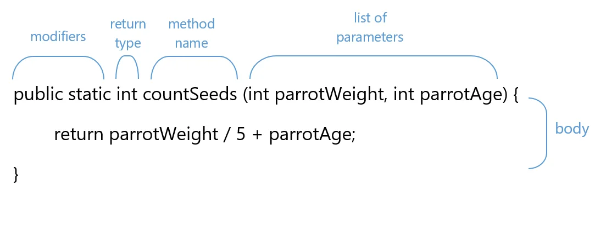

# Java Method

- A method is a block of code which only runs when it is called.
- You can pass data, known as parameters, into a method.
- Methods are used to perform certain actions, and they are also known as functions.
- Why use methods? To reuse code: define the code once, and use it many times.

## Creating a Java Method

To create a Java method, there should be an `access modifier` followed by the `return type`, `method's name`, and
`parameters list`.

### Syntax to Create a Java Method

Considering the following example to explain the syntax of a method −

```java
modifier returnType nameOfMethod(Parameter List){
    // method body
    }
```



The syntax shown above includes −

- **modifier** − It defines the access type of the method and it is optional to use.
- **returnType** − Method may return a value.
- **nameOfMethod** − This is the method name. The method signature consists of the method name and the parameter list.
- **Parameter List** − The list of parameters, it is the type, order, and number of parameters of a method. These are
  optional, method may contain zero parameters.
- **method body** − The method body defines what the method does with the statements.

The combination of the name of the method and the list of its parameters is known as a method signature. In our example,
the signature is countSeeds(int, int).

Some methods also have a list of _exceptions_ — they define the method's behavior in case of a mistake in the program.
If during the execution of a method, one of its exceptions is thrown, the exception is handled outside the method. For
now, we'll consider simple methods without exceptions.

### Name of the method

Each method has a name that is used to call it. Generally, it reflects what the method does – prints, finds, calculates,
and provides you with some information.

The Java compiler requires a method name to be a legal identifier. The rules for legal identifiers are the following:

- identifiers are case-sensitive;
- an identifier can include Unicode letters, digits, underscore _ or currency characters, such as $;
- an identifier can't start with a digit;
- identifiers must not be a keyword.

In addition, there is a naming convention that restricts possible method names. It's optional but desired for
developers. By convention, a one-word name should be a verb in lowercase: `sum`, `multiply`, or `round`. On the
contrary, such names as `recorded`, `students` or `highest` do not comply with the convention.

If a method has a multi-word name, the first letter of the second and the following words should be
capitalized: `getValue`, `calculateNumberOfOranges`, or `findLetter`.

### Modifiers

The first words are so-called modifiers. There are two types of modifiers in Java: **access modifiers** and **non-access
modifiers**.

**Access modifiers** define the visibility of the method. For now, we're using a `public` access modifier, which means
there are _no restrictions for invoking the method from anywhere_.

**Non-access modifiers** provide information about the behavior of methods to JVM. The modifier `static` means that the
method belongs to the class and it can be accessed without creating any object. This type of method is called a
_static method_.

If the method is declared without the static modifier, it means that the method can be invoked only through or with an
object or instance of this class. Such methods are called _instance methods_.

Remember that there is a recommended order for the modifiers that you can find in the Java Language Specification. In
our case, it is public static.

### Method parameters

In parentheses after the method name, we define the type, number, and order of the parameters. This reflects how they
will be passed to the method when it is invoked. Take a look at these signatures:

```text
convertEurosToDollars(double dlrRate, long eur);
countMonthlySpendings(long food, long rent, long fun);
replace(char a, char b);
```

As you know, there are also methods that don't have values passed to them. These methods are known as _
non-parameterized_.

### Body and return statement

Before a method completes its execution and exits, it returns a value known as a return value. The result of your method
execution can be a value of primitive types like int, float, double, boolean, or reference types like String. Take a
look at our countSeeds method with the return type int:

```java
public class TestMethod {
  public static int countSeeds(int parrotWeight, int parrotAge) {
    return parrotWeight / 5 + parrotAge; // it returns an int
  }
}
```

What you see inside the curly brackets is known as the body of the method. The body holds the logic we want to implement
by our method: a set of statements to perform with the passed values to obtain the result. Our method countSeeds takes
two provided values, performs certain calculations, and returns the result within a return statement.

Methods do not necessarily have to return a value. If we want a method not to return a value but to perform operations
only, the keyword void is used as a return type. Take a look at printSeedsCount method:

```java
public class TestMethod {
  // the following method just prints the line, so it returns no value
  public static void printSeedsCount(int seeds) {
    System.out.println("Give your parrot " + seeds + "g of seeds per day");
  }
}
```

When this method is called it prints the line with recommendations on feeding the parrot and does not allow us to keep a
value. Note that there is no return statement.

Though methods with a void return type return nothing, you still may use a return word to exit the method. Usually, this
applies to methods with conditions. Take a look:

```java
public class TestMethod {
  public static void isPositive(int num) {
    if (num > 0) {
      System.out.println("the number is positive");
    }
    else {
      return;
    }
  }
}
```

> Remember, that if you try to return a value from a method with a void return type, a compile error will be thrown.

## How to call a method

A method must be declared within a class.
It is defined with the name of the method, followed by **parentheses ()**.
Java provides some pre-defined methods, such as System.out.println(),
but you can also create your own methods to perform certain actions:

## Method Parameter and Argument

When a parameter is passed to the method, it is called an argument.

```text
// calling the method with two parameters
addNumbers(25, 15);

// calling the method with no parameters
addNumbers()
```

## Method with return type

The void keyword, used in the examples above, indicates that the method should not return a value.
If you want the method to return a value, you can use a primitive data type (such as int, char, etc.) instead of void,
and use the return keyword inside the method:

```java
public class Main {
  static int myMethod(int x) {
    return 5 + x;
  }

  public static void main(String[] args) {
    System.out.println(myMethod(3));
  }
}
// Outputs 8 (5 + 3)
```

## Return type with if..else

if you use if..else in the method with return value, you can have more than one `return` keyword
when the code reach return; the method will be stopped
you MUST always at least have the `return` keyword at the end of you method

## Method Overloading

With method overloading, multiple methods can have the same name with different parameters:

```text
int myMethod(int x)
float myMethod(float x)
double myMethod(double x, double y)
```

## Document the method
it optional to explain what the method 
